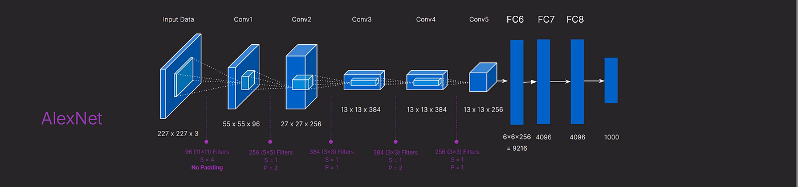

# EN3150 Assignment03-  Simple convolutional neural network to perform classification.
# Group - SkyNet
## Group Members
- 220332P - Kularathna A. K. D. D. D. - DilshanKularathna(GitHub)
- 220605G - Shaluka T. D. L. - lasindushaluka(GitHub)
- 220648N - Thrimanna K. D. D. - deshan0(GitHub)
- 220481U - Pitigala P.K.N.W.

# Task 01 — Custom CNN for Image Classification 

## Objective
- Design and train a CNN model for image classification.
- Experiment with activation functions, optimizers, and learning rate.
- Train for 20 epochs and plot training/validation loss curves.
- Evaluate model performance using accuracy and confusion matrix.
- Compare optimizer performance (SGD, SGD + Momentum, and Adam).

## Model Architecture

## Training Configuration

# Task 02
## AlexNet Implementation - 220332P
### AlexNet Architecture

<!--  -->
  
*AlexNet Architecture*
